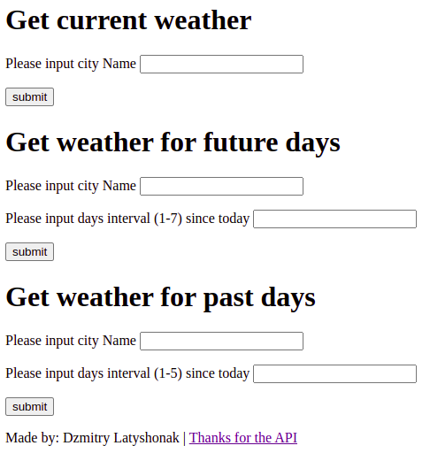
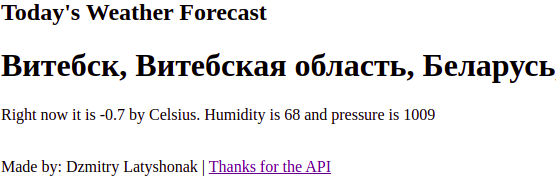
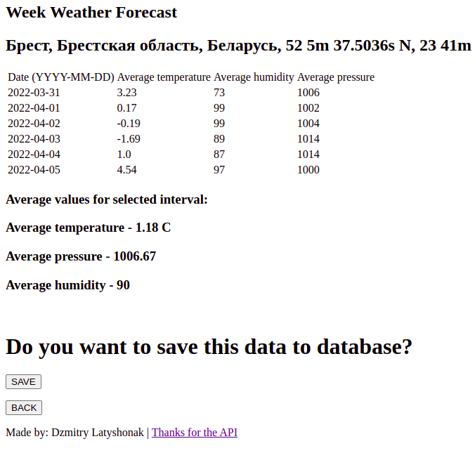
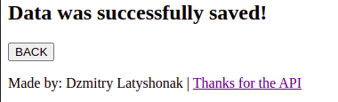
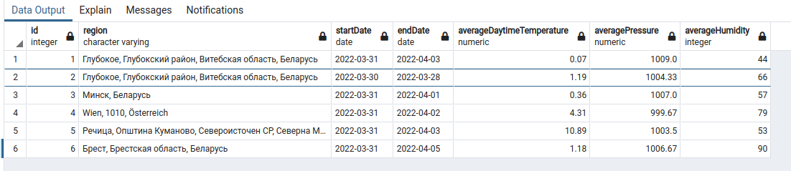
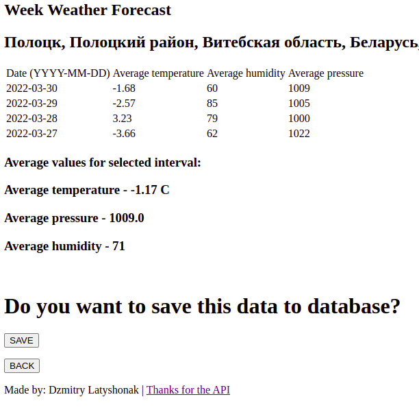
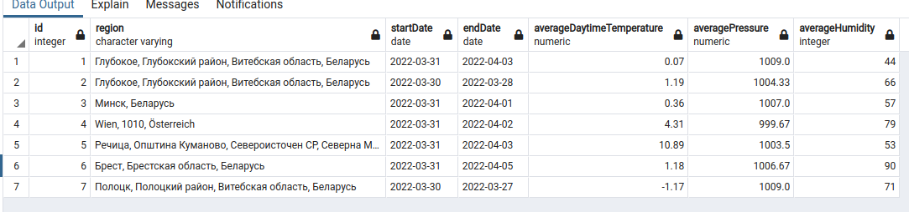

This application was made for getting and saving weather forecast to the database. 
It was made by using Flask framework, ORM is SQLAlchemy and  PostgreSQL database.
Also code is using https://openweathermap.org/api weather api (unfortunately, only calls
for 5 days in the past and 7 days in the future are free, if you want more info you must
pay for the api to get unique app id to get access to paid content)

### Here you can see the main page of the application. User can choose for which city he wants to know the weather and also for which time (3 options: current city weather, future weather <u>for 1-7 days, or weather from the pas 1-5 days)</u>

### For example, if you want to know current weather, you need to fill in input field and press submit button, the result is in <u>the screenshot:</u>

### If you'll choose to know future weather, the result will be like on the screenshot. You could also turn back to main page by pressing 'back' button. The resulting page will contain info about city name, table with collected data, and average data <u>for selected days period. (Brest city and 6 days):</u>

### Also there is a case to save collected data to database (by <u>pressing 'save' button), the result is in the next screenshots:</u>

### If you'll choose to know weather from the past, you will see <u>this (also could be saved to db)</u>

