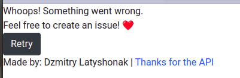
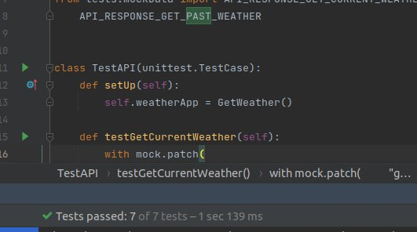

This application was made for getting and saving weather forecast to the database. 
It was made by using Flask framework, ORM is SQLAlchemy and  PostgreSQL database.
Also code is using https://openweathermap.org/api weather api (unfortunately, only calls
for 5 days in the past and 7 days in the future are free, if you want more info you must
pay for the api to get unique app id to get access to paid content). Code also contain api tests and functionality tests.

### Here you can see the main page of the application. User can choose for which city he wants to know the weather and also for which time (3 options: current city weather, future weather for 1-7 days, or weather from the pas 1-5 days)

### For example, if you want to know current weather, you need to fill in input field and press submit button, the result is in the screenshot:

### If you'll choose to know future weather, the result will be like on the screenshot. You could also turn back to main page by pressing 'back' button. The resulting page will contain info about city name, table with collected data, and average data for selected days period. (Brest city and 6 days):

### Also there is a case to save collected data to database (by pressing 'save' button), it will save “region”: string, “startDate”: date, “endDate”: date, “averageTemperature”: decimal, “averagePressure”: decimal, “averageHumidity”: integer for selected period. The result is in the next screenshots:

### If you'll choose to know weather from the past, you will see this (also could be saved to db)

### In case if something will go wrong you will see next message:

### Code have test coverage with some api and functionality tests

### Steps to run projects on your local:
1. git clone repo
2. create venv
3. pip install requirements.txt to you venv
4. provide SQLALCHEMY_DATABASE_URI (database uri), SECRET_KEY (app secret key), APP_ID (your app id, token to make requests to weather api) values in .env file
5. run the project and enjoy the functionality :)

### Writing this project took about ~18-20 hours for me (including api selection, writing code with comments and so on, writing tests, testing functionality, writing readme and etc.) Code is not ideal and should be improved, as everything could be improved in this world, but at the moment it makes entrusted to it tasks and the code is readable enough.